How to get the average nLTT plot
================

Calculating the average nLTT plot of multiple phylogenies is not a
trivial tasks. The function `get_nltt_values()` does exactly this.

## Examples

For all examples, the following R code must be run:

``` r
library(ape)
library(Hmisc)
library(nLTT) # nolint
library(ggplot2)
library(testit)
```

### Example: Easy trees

Create two easy trees:

``` r
newick1 <- "((A:1,B:1):2,C:3);"
newick2 <- "((A:2,B:2):1,C:3);"
phylogeny1 <- ape::read.tree(text = newick1)
phylogeny2 <- ape::read.tree(text = newick2)
phylogenies <- c(phylogeny1, phylogeny2)
```

There are very similar. phylogeny1 has short tips:

``` r
plot(phylogeny1)
add.scale.bar() #nolint
```

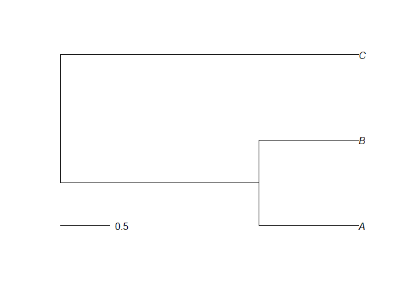<!-- -->

This can be observed in the nLTT plot:

``` r
nltt_plot(phylogeny1, ylim = c(0, 1))
```

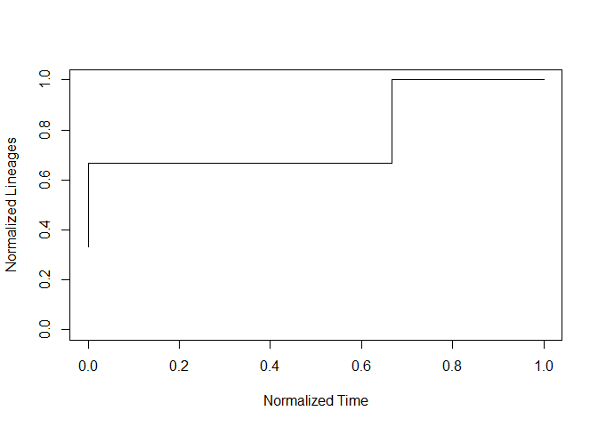<!-- -->

As a collection of timepoints:

``` r
t <- nLTT::get_phylogeny_nltt_matrix(phylogeny1)
knitr::kable(t)
```

|      time |         N |
|----------:|----------:|
| 0.0000000 | 0.3333333 |
| 0.6666667 | 0.6666667 |
| 1.0000000 | 1.0000000 |

Plotting those timepoints:

``` r
df <- as.data.frame(nLTT::get_phylogeny_nltt_matrix(phylogeny1))
qplot(
  time,
  N,
  data = df,
  geom = "step",
  ylim = c(0, 1),
  direction = "vh",
  main = "NLTT plot of phylogeny 1"
)
```

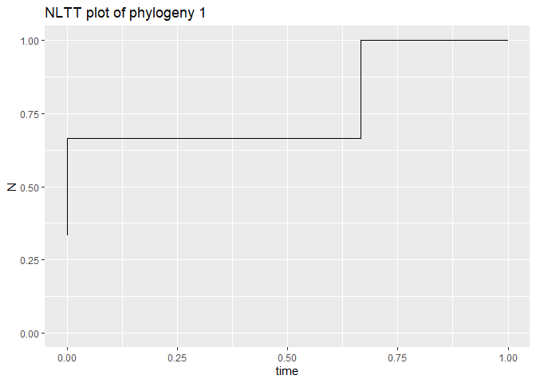<!-- -->

phylogeny2 has longer tips:

``` r
plot(phylogeny2)
add.scale.bar() #nolint
```

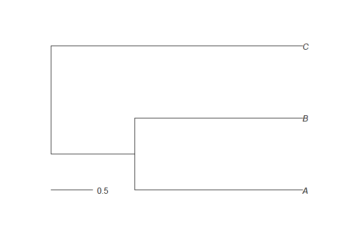<!-- -->

Also this can be observed in the nLTT plot:

``` r
nltt_plot(phylogeny2, ylim = c(0, 1))
```

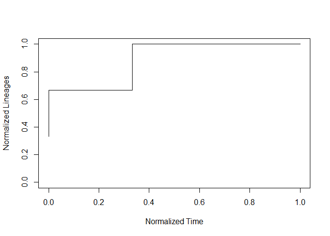<!-- -->

As a collection of timepoints:

``` r
t <- nLTT::get_phylogeny_nltt_matrix(phylogeny2)
knitr::kable(t)
```

|      time |         N |
|----------:|----------:|
| 0.0000000 | 0.3333333 |
| 0.3333333 | 0.6666667 |
| 1.0000000 | 1.0000000 |

Plotting those timepoints:

``` r
df <- as.data.frame(nLTT::get_phylogeny_nltt_matrix(phylogeny2))
qplot(
  time,
  N,
  data = df,
  geom = "step",
  ylim = c(0, 1),
  direction = "vh",
  main = "NLTT plot of phylogeny 2"
)
```

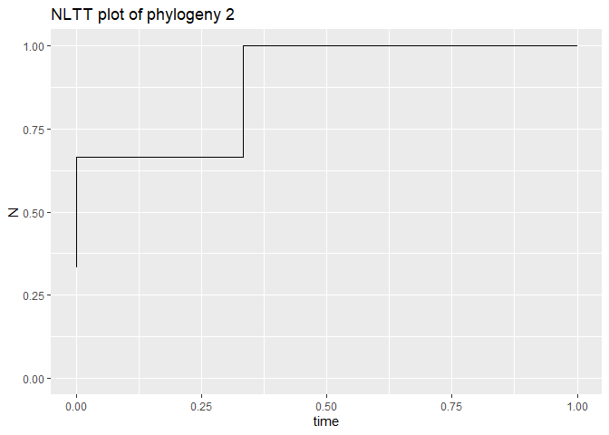<!-- -->

The average nLTT plot should be somewhere in the middle.

It is constructed from stretched nLTT matrices.

Here is the nLTT matrix of the first phylogeny:

``` r
t <-
  nLTT::stretch_nltt_matrix(nLTT::get_phylogeny_nltt_matrix(phylogeny1),
                            dt = 0.20,
                            step_type = "upper")
knitr::kable(t)
```

|     |           |
|----:|----------:|
| 0.0 | 0.6666667 |
| 0.2 | 0.6666667 |
| 0.4 | 0.6666667 |
| 0.6 | 0.6666667 |
| 0.8 | 1.0000000 |
| 1.0 | 1.0000000 |

Here is the nLTT matrix of the second phylogeny:

``` r
t <-
  nLTT::stretch_nltt_matrix(nLTT::get_phylogeny_nltt_matrix(phylogeny2),
                            dt = 0.20,
                            step_type = "upper")
knitr::kable(t)
```

|     |           |
|----:|----------:|
| 0.0 | 0.6666667 |
| 0.2 | 0.6666667 |
| 0.4 | 1.0000000 |
| 0.6 | 1.0000000 |
| 0.8 | 1.0000000 |
| 1.0 | 1.0000000 |

Here is the average nLTT matrix of both phylogenies:

``` r
t <- nLTT::get_average_nltt_matrix(phylogenies, dt = 0.20)
knitr::kable(t)
```

|     |           |
|----:|----------:|
| 0.0 | 0.6666667 |
| 0.2 | 0.6666667 |
| 0.4 | 0.8333333 |
| 0.6 | 0.8333333 |
| 0.8 | 1.0000000 |
| 1.0 | 1.0000000 |

Observe how the numbers get averaged.

The same, now shown as a plot:

``` r
nLTT::nltts_plot(phylogenies, dt = 0.20, plot_nltts = TRUE)
```

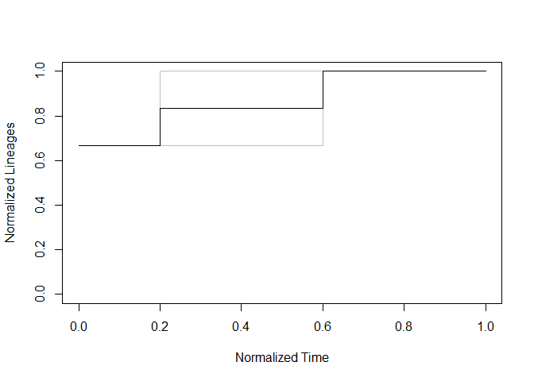<!-- -->

Here a demo how the new function works:

``` r
t <- nLTT::get_nltt_values(c(phylogeny1, phylogeny2), dt = 0.2)
knitr::kable(t)
```

| id  |   t |      nltt |
|:----|----:|----------:|
| 1   | 0.0 | 0.6666667 |
| 1   | 0.2 | 0.6666667 |
| 1   | 0.4 | 0.6666667 |
| 1   | 0.6 | 0.6666667 |
| 1   | 0.8 | 1.0000000 |
| 1   | 1.0 | 1.0000000 |
| 2   | 0.0 | 0.6666667 |
| 2   | 0.2 | 0.6666667 |
| 2   | 0.4 | 1.0000000 |
| 2   | 0.6 | 1.0000000 |
| 2   | 0.8 | 1.0000000 |
| 2   | 1.0 | 1.0000000 |

Plotting options, first create a data frame:

``` r
df <- nLTT::get_nltt_values(c(phylogeny1, phylogeny2), dt = 0.01)
```

Here we see an averaged nLTT plot, where the original nLTT values are
still visible:

``` r
qplot(
  t,
  nltt,
  data = df,
  geom = "point",
  ylim = c(0, 1),
  main = "Average nLTT plot of phylogenies",
  color = id,
  size = I(0.1)
) +
  stat_summary(fun.data = "mean_cl_boot",
               color = "red",
               geom = "smooth")
```

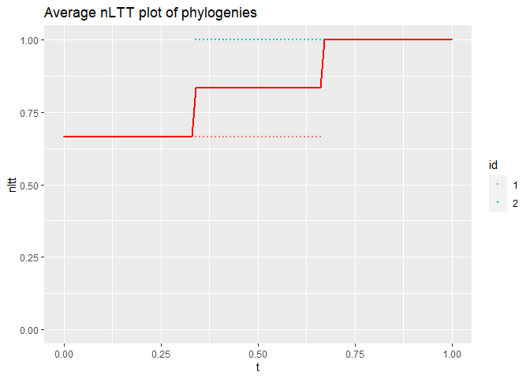<!-- -->

Here we see an averaged nLTT plot, with the original nLTT values
omitted:

``` r
qplot(
  t,
  nltt,
  data = df,
  geom = "blank",
  ylim = c(0, 1),
  main = "Average nLTT plot of phylogenies"
) +
  stat_summary(fun.data = "mean_cl_boot",
               color = "red",
               geom = "smooth")
```

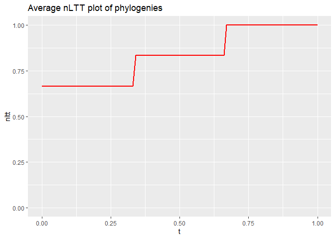<!-- -->

### Example: Harder trees

Create two harder trees:

``` r
newick1 <- "((A:1,B:1):1,(C:1,D:1):1);"
newick2 <-
  paste0(
    "((((XD:1,ZD:1):1,CE:2):1,(FE:2,EE:2):1):4,((AE:1,BE:1):1,",
    "(WD:1,YD:1):1):5);"
  )
phylogeny1 <- ape::read.tree(text = newick1)
phylogeny2 <- ape::read.tree(text = newick2)
phylogenies <- c(phylogeny1, phylogeny2)
```

There are different. phylogeny1 is relatively simple, with two branching
events happening at the same time:

``` r
plot(phylogeny1)
add.scale.bar() #nolint
```

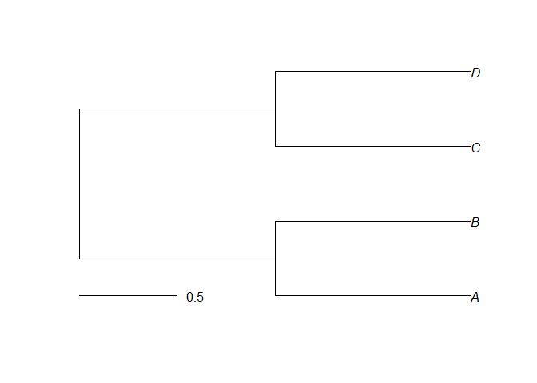<!-- -->

This can be observed in the nLTT plot:

``` r
nltt_plot(phylogeny1, ylim = c(0, 1))
```

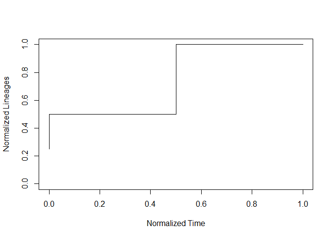<!-- -->

As a collection of timepoints:

``` r
t <- nLTT::get_phylogeny_nltt_matrix(phylogeny2)
knitr::kable(t)
```

|      time |         N |
|----------:|----------:|
| 0.0000000 | 0.1111111 |
| 0.5714286 | 0.2222222 |
| 0.7142857 | 0.3333333 |
| 0.7142857 | 0.4444444 |
| 0.7142857 | 0.5555556 |
| 0.8571429 | 0.6666667 |
| 0.8571429 | 0.7777778 |
| 0.8571429 | 0.8888889 |
| 1.0000000 | 1.0000000 |

phylogeny2 is more elaborate:

``` r
plot(phylogeny2)
add.scale.bar() #nolint
```

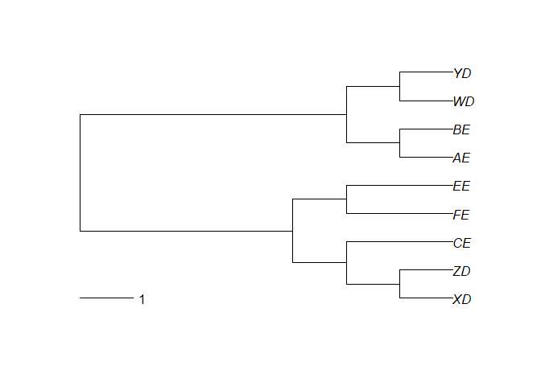<!-- -->

Also this can be observed in the nLTT plot:

``` r
nltt_plot(phylogeny2, ylim = c(0, 1))
```

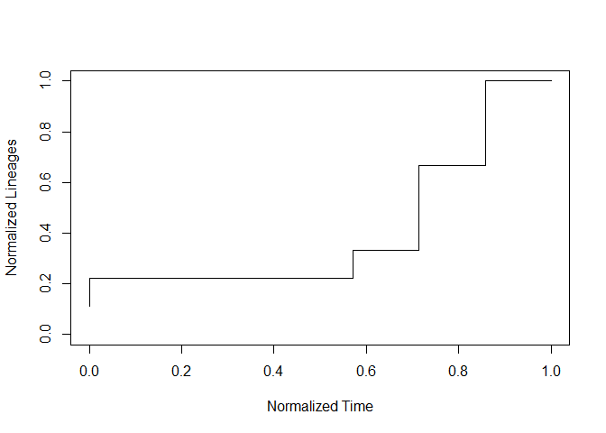<!-- -->

As a collection of timepoints:

``` r
t <- nLTT::get_phylogeny_nltt_matrix(phylogeny2)
knitr::kable(t)
```

|      time |         N |
|----------:|----------:|
| 0.0000000 | 0.1111111 |
| 0.5714286 | 0.2222222 |
| 0.7142857 | 0.3333333 |
| 0.7142857 | 0.4444444 |
| 0.7142857 | 0.5555556 |
| 0.8571429 | 0.6666667 |
| 0.8571429 | 0.7777778 |
| 0.8571429 | 0.8888889 |
| 1.0000000 | 1.0000000 |

The average nLTT plot should be somewhere in the middle.

It is constructed from stretched nLTT matrices.

Here is the nLTT matrix of the first phylogeny:

``` r
t <-
  nLTT::stretch_nltt_matrix(nLTT::get_phylogeny_nltt_matrix(phylogeny1),
                            dt = 0.20,
                            step_type = "upper")
knitr::kable(t)
```

|     |     |
|----:|----:|
| 0.0 | 0.5 |
| 0.2 | 0.5 |
| 0.4 | 0.5 |
| 0.6 | 1.0 |
| 0.8 | 1.0 |
| 1.0 | 1.0 |

Here is the nLTT matrix of the second phylogeny:

``` r
t <-
  nLTT::stretch_nltt_matrix(nLTT::get_phylogeny_nltt_matrix(phylogeny2),
                            dt = 0.20,
                            step_type = "upper")
knitr::kable(t)
```

|     |           |
|----:|----------:|
| 0.0 | 0.2222222 |
| 0.2 | 0.2222222 |
| 0.4 | 0.2222222 |
| 0.6 | 0.3333333 |
| 0.8 | 0.6666667 |
| 1.0 | 1.0000000 |

Here is the average nLTT matrix of both phylogenies:

``` r
t <- nLTT::get_average_nltt_matrix(phylogenies, dt = 0.20)
knitr::kable(t)
```

|     |           |
|----:|----------:|
| 0.0 | 0.3611111 |
| 0.2 | 0.3611111 |
| 0.4 | 0.3611111 |
| 0.6 | 0.6666667 |
| 0.8 | 0.8333333 |
| 1.0 | 1.0000000 |

Observe how the numbers get averaged.

Here a demo how the new function works:

``` r
t <- nLTT::get_nltt_values(c(phylogeny1, phylogeny2), dt = 0.2)
knitr::kable(t)
```

| id  |   t |      nltt |
|:----|----:|----------:|
| 1   | 0.0 | 0.5000000 |
| 1   | 0.2 | 0.5000000 |
| 1   | 0.4 | 0.5000000 |
| 1   | 0.6 | 1.0000000 |
| 1   | 0.8 | 1.0000000 |
| 1   | 1.0 | 1.0000000 |
| 2   | 0.0 | 0.2222222 |
| 2   | 0.2 | 0.2222222 |
| 2   | 0.4 | 0.2222222 |
| 2   | 0.6 | 0.3333333 |
| 2   | 0.8 | 0.6666667 |
| 2   | 1.0 | 1.0000000 |

Plotting options, first create a data frame:

``` r
df <- nLTT::get_nltt_values(c(phylogeny1, phylogeny2), dt = 0.01)
```

Here we see an averaged nLTT plot, where the original nLTT values are
still visible:

``` r
qplot(
  t,
  nltt,
  data = df,
  geom = "point",
  ylim = c(0, 1),
  main = "Average nLTT plot of phylogenies",
  color = id,
  size = I(0.1)
) +
  stat_summary(fun.data = "mean_cl_boot",
               color = "red",
               geom = "smooth")
```

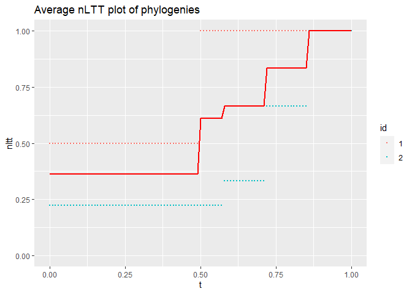<!-- -->

Here we see an averaged nLTT plot, with the original nLTT values
omitted:

``` r
qplot(
  t,
  nltt,
  data = df,
  geom = "blank",
  ylim = c(0, 1),
  main = "Average nLTT plot of phylogenies"
) +
  stat_summary(fun.data = "mean_cl_boot",
               color = "red",
               geom = "smooth")
```

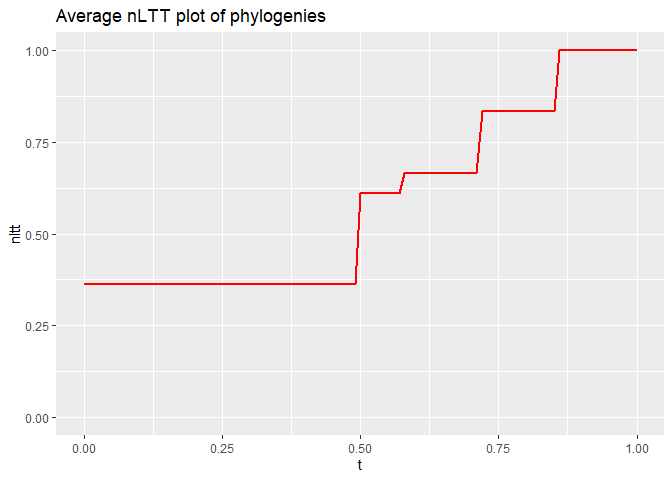<!-- -->

### Example: Five random trees

Create three random trees:

``` r
set.seed(42)
phylogeny1 <- rcoal(10)
phylogeny2 <- rcoal(20)
phylogeny3 <- rcoal(30)
phylogeny4 <- rcoal(40)
phylogeny5 <- rcoal(50)
phylogeny6 <- rcoal(60)
phylogeny7 <- rcoal(70)
phylogenies <- c(phylogeny1,
                 phylogeny2,
                 phylogeny3,
                 phylogeny4,
                 phylogeny5,
                 phylogeny6,
                 phylogeny7)
```

Here a demo how the new function works:

``` r
t <- nLTT::get_nltt_values(phylogenies, dt = 0.2)
knitr::kable(t)
```

| id  |   t |      nltt |
|:----|----:|----------:|
| 1   | 0.0 | 0.2000000 |
| 1   | 0.2 | 0.2000000 |
| 1   | 0.4 | 0.2000000 |
| 1   | 0.6 | 0.2000000 |
| 1   | 0.8 | 0.3000000 |
| 1   | 1.0 | 1.0000000 |
| 2   | 0.0 | 0.1000000 |
| 2   | 0.2 | 0.1000000 |
| 2   | 0.4 | 0.1500000 |
| 2   | 0.6 | 0.1500000 |
| 2   | 0.8 | 0.2000000 |
| 2   | 1.0 | 1.0000000 |
| 3   | 0.0 | 0.0666667 |
| 3   | 0.2 | 0.1000000 |
| 3   | 0.4 | 0.1333333 |
| 3   | 0.6 | 0.1666667 |
| 3   | 0.8 | 0.4000000 |
| 3   | 1.0 | 1.0000000 |
| 4   | 0.0 | 0.0500000 |
| 4   | 0.2 | 0.0500000 |
| 4   | 0.4 | 0.0750000 |
| 4   | 0.6 | 0.0750000 |
| 4   | 0.8 | 0.1500000 |
| 4   | 1.0 | 1.0000000 |
| 5   | 0.0 | 0.0400000 |
| 5   | 0.2 | 0.0400000 |
| 5   | 0.4 | 0.0400000 |
| 5   | 0.6 | 0.0400000 |
| 5   | 0.8 | 0.1000000 |
| 5   | 1.0 | 1.0000000 |
| 6   | 0.0 | 0.0333333 |
| 6   | 0.2 | 0.0333333 |
| 6   | 0.4 | 0.0333333 |
| 6   | 0.6 | 0.0666667 |
| 6   | 0.8 | 0.0833333 |
| 6   | 1.0 | 1.0000000 |
| 7   | 0.0 | 0.0285714 |
| 7   | 0.2 | 0.0428571 |
| 7   | 0.4 | 0.0428571 |
| 7   | 0.6 | 0.0857143 |
| 7   | 0.8 | 0.1142857 |
| 7   | 1.0 | 1.0000000 |

Here we see an averaged nLTT plot, where the original nLTT values are
still visible:

``` r
qplot(
  t,
  nltt,
  data = df,
  geom = "point",
  ylim = c(0, 1),
  main = "Average nLTT plot of phylogenies",
  color = id,
  size = I(0.1)
) +
  stat_summary(fun.data = "mean_cl_boot",
               color = "red",
               geom = "smooth")
```

<!-- -->

Here we see an averaged nLTT plot, with the original nLTT values
omitted:

``` r
qplot(
  t,
  nltt,
  data = df,
  geom = "blank",
  ylim = c(0, 1),
  main = "Average nLTT plot of phylogenies"
) +
  stat_summary(fun.data = "mean_cl_boot",
               color = "red",
               geom = "smooth")
```

<!-- -->
