How to stretch an nLTT timepoints matrix
================

An nLTT plot consists out of points that denote a number of (normalized)
lineages in (normalized) time. For nLTT plots with only a few points,
`stretch_nltt_matrix()` inserts timepoints.

## Examples

For all examples, the following R code must be run:

``` r
library(ape)
library(nLTT) # nolint
library(testit)
```

### Example: Easy tree

Create an easy tree:

``` r
newick <- "((A:1,B:1):1,C:2);"
phylogeny <- ape::read.tree(text = newick)
plot(phylogeny)
add.scale.bar() #nolint
```

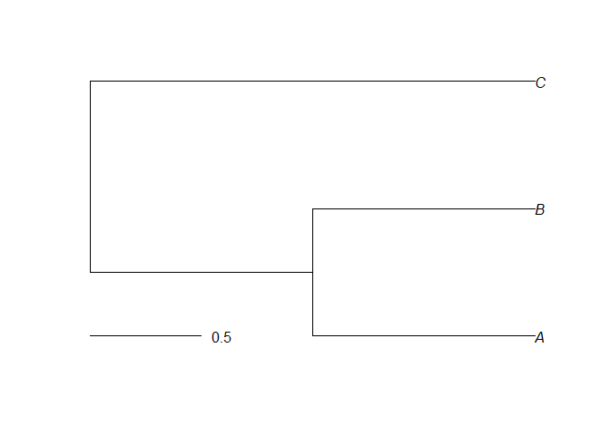<!-- -->

From this tree, we can create an nLTT plot:

``` r
nltt_plot(phylogeny)
```

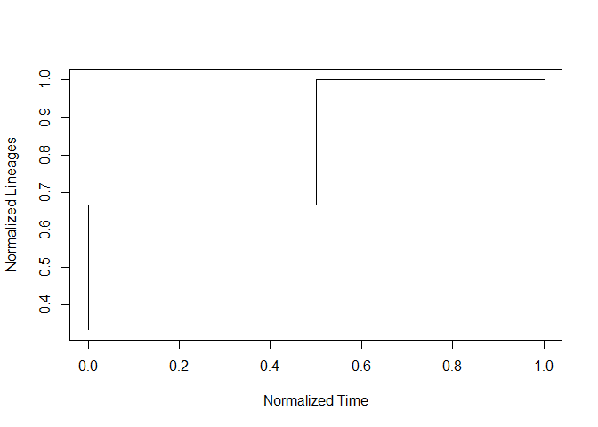<!-- -->

We can extract the timepoints of the nLTT plot using the
`get_phylogeny_nltt_matrix()` function.

``` r
nltt <- nLTT::get_phylogeny_nltt_matrix(phylogeny)
print(nltt)
```

    ##      time         N
    ## [1,]  0.0 0.3333333
    ## [2,]  0.5 0.6666667
    ## [3,]  1.0 1.0000000

The timepoints are plotted in red over the nLTT plot:

``` r
nltt_plot(phylogeny)
points(nltt, pch = 19, col = "red")
```

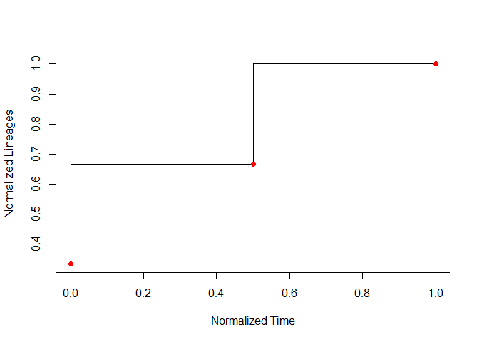<!-- -->

The function `stretch_nltt_matrix()` inserts timepoints, as shown in
this table:

``` r
nltt <- nLTT::get_phylogeny_nltt_matrix(phylogeny)
stretch_matrix <-
  nLTT::stretch_nltt_matrix(nltt, dt = 0.25, step_type = "upper")
print(stretch_matrix)
```

    ##      [,1]      [,2]
    ## [1,] 0.00 0.6666667
    ## [2,] 0.25 0.6666667
    ## [3,] 0.50 1.0000000
    ## [4,] 0.75 1.0000000
    ## [5,] 1.00 1.0000000

Plotting these as blue points between the red points:

``` r
nltt_plot(phylogeny)
points(nltt, pch = 19, col = "red")
points(stretch_matrix, pch = 19, col = "blue")
```

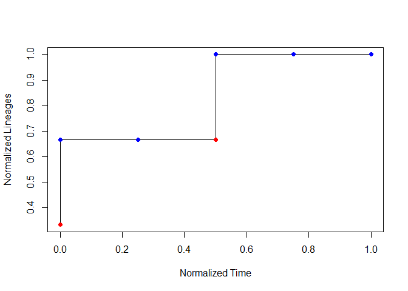<!-- -->

A good result is when all blue points fall on the line.

### Example: Tree that has two branching events at the same time

Create an easy tree:

``` r
newick <- "((A:1,B:1):1,(C:1,D:1):1);"
phylogeny <- ape::read.tree(text = newick)
plot(phylogeny)
add.scale.bar() #nolint
```

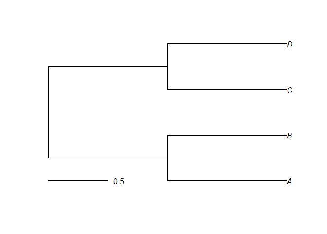<!-- -->

From this tree, we can create an nLTT plot:

``` r
nltt_plot(phylogeny)
```

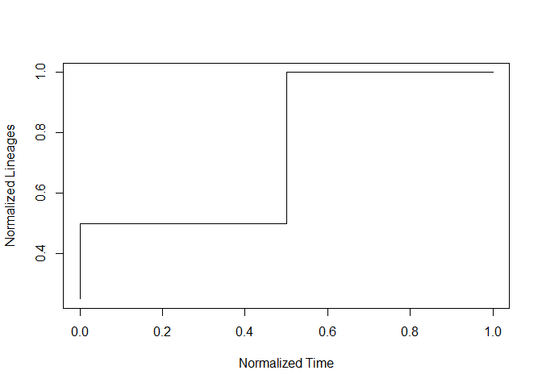<!-- -->

We can extract the timepoints of the nLTT plot using the
`get_phylogeny_nltt_matrix()` function.

``` r
nltt <- nLTT::get_phylogeny_nltt_matrix(phylogeny)
print(nltt)
```

    ##      time    N
    ## [1,]  0.0 0.25
    ## [2,]  0.5 0.50
    ## [3,]  0.5 0.75
    ## [4,]  1.0 1.00

The timepoints are plotted in red over the nLTT plot:

``` r
nltt_plot(phylogeny)
points(nltt, pch = 19, col = "red")
```

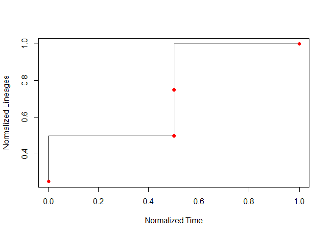<!-- -->

The function stretch\_nltt\_matrix inserts timepoints, as shown in this
table:

``` r
nltt <- nLTT::get_phylogeny_nltt_matrix(phylogeny)
stretch_matrix <-
  nLTT::stretch_nltt_matrix(nltt, dt = 0.25, step_type = "upper")
print(stretch_matrix)
```

    ##      [,1] [,2]
    ## [1,] 0.00  0.5
    ## [2,] 0.25  0.5
    ## [3,] 0.50  1.0
    ## [4,] 0.75  1.0
    ## [5,] 1.00  1.0

Plotting these as blue points between the red points:

``` r
nltt_plot(phylogeny)
points(nltt, pch = 19, col = "red")
points(stretch_matrix, pch = 19, col = "blue")
```

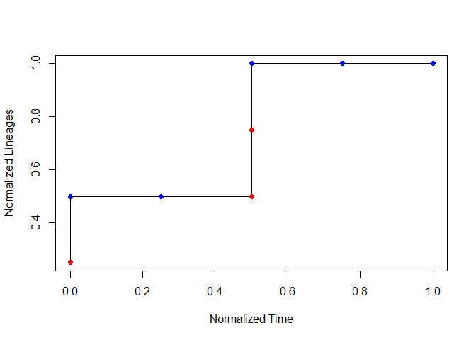<!-- -->

A good result is when all blue points fall on the line.

### Example: Complex tree

Create a complex tree:

``` r
newick <-
  paste0(
    "((((XD:1,ZD:1):1,CE:2):1,(FE:2,EE:2):1):4,((AE:1,BE:1):1,",
    "(WD:1,YD:1):1):5);"
  )
phylogeny <- ape::read.tree(text = newick)
plot(phylogeny)
add.scale.bar() #nolint
```

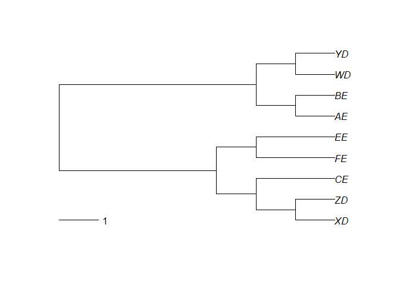<!-- -->

From this tree, we can create an nLTT plot:

``` r
nltt_plot(phylogeny)
```

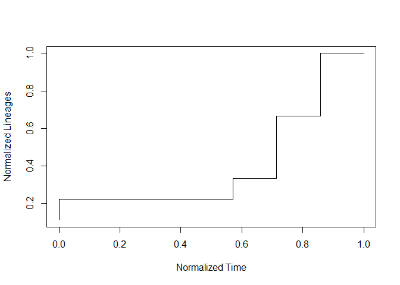<!-- -->

We can extract the timepoints of the nLTT plot using the
`get_phylogeny_nltt_matrix()` function.

``` r
nltt <- nLTT::get_phylogeny_nltt_matrix(phylogeny)
print(nltt)
```

    ##            time         N
    ##  [1,] 0.0000000 0.1111111
    ##  [2,] 0.5714286 0.2222222
    ##  [3,] 0.7142857 0.3333333
    ##  [4,] 0.7142857 0.4444444
    ##  [5,] 0.7142857 0.5555556
    ##  [6,] 0.8571429 0.6666667
    ##  [7,] 0.8571429 0.7777778
    ##  [8,] 0.8571429 0.8888889
    ##  [9,] 1.0000000 1.0000000

The timepoints are plotted in red over the nLTT plot:

``` r
nltt_plot(phylogeny)
points(nltt, pch = 19, col = "red")
```

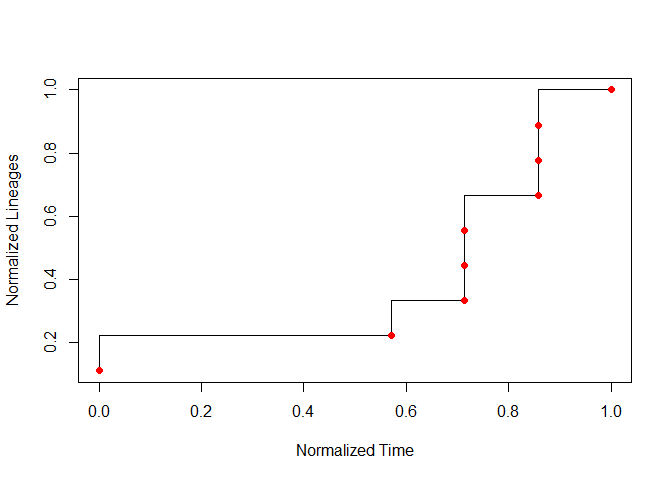<!-- -->

The function stretch\_nltt\_matrix inserts blue points between these red
points:

``` r
nltt <- nLTT::get_phylogeny_nltt_matrix(phylogeny)
nltt_plot(phylogeny)
stretch_matrix <-
  nLTT::stretch_nltt_matrix(nltt, dt = 0.05, step_type = "upper")
points(nltt, pch = 19, col = "red")
points(stretch_matrix, pch = 19, col = "blue")
```

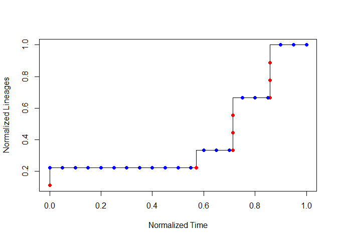<!-- -->

A good result is when all blue points fall on the line.
