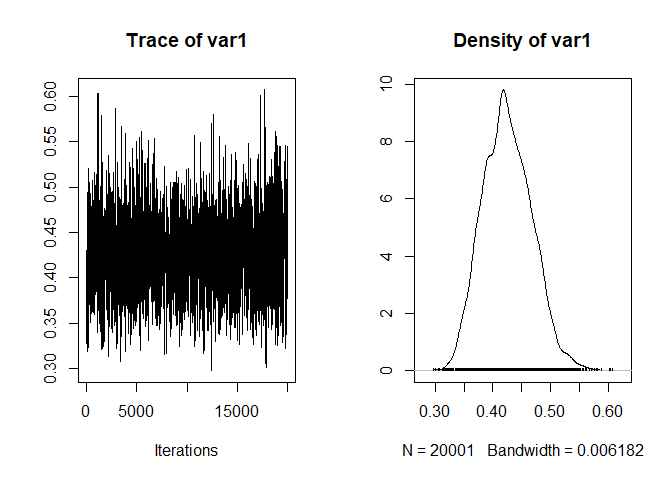
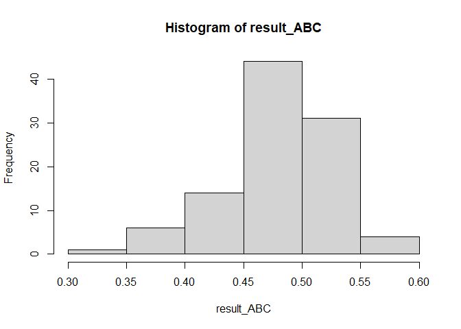

MCMC & ABC SMC examples
================

## Examples of MCMC and ABC-SMC fitting

The nLTT statistic is designed to replace the classic approach using a
likelihood. In order to assess the performance of the nLTT statistic
within an approximate Bayesian computation framework, we compare the
performance with that a similar Bayesian approach using the likelihood:
a Monte Carlo Markov Chain (MCMC) approach. The MCMC makes uses of
Metropolis Hastings to propagate the chain.

## Using the classical likelihood approach: MCMC

We first need a tree to fit on. For simplicity we will only fit the
birth rate of the birth-death model, but in principle this approach can
be extended to any model that can generate a phylogenetic tree, provided
that the likelihood is known (e.g. a time dependent speciation model, or
diversity dependent speciation model). We use the package TESS to
generate a tree following the birth-death model, keeping death
(extinction) at zero, and setting birth at 0.5.

``` r
set.seed(42)
tree1 <-
  TESS::tess.sim.taxa(
    n = 1,
    nTaxa = 100,
    max = 10,
    lambda = 0.5,
    mu = 0.0
  )[[1]]
```

Before specifying our likelihood function, we have to specify our prior,
which we’ll set at an exponential function with a mean of 0.1.

``` r
prior_dens <- function(val) {
  return(dexp(val[1], rate = 10))
}
```

We then specify our likelihood function, in order to perform the MCMC:

``` r
LL_B <- function(params, phy) {
  lnl <- TESS::tess.likelihood(
    ape::branching.times(phy),
    lambda = params[1],
    mu = 0.0,
    samplingProbability = 1,
    log = TRUE
  )
  prior1  <- log(prior_dens(params))
  return(lnl + prior1)
}
```

We are now all set to perform the MCMC. Success of the MCMC depends on
the length of the chain, and the size of the jumps (sigma). Furthermore
the user has the option of restricting the MCMC to only make jumps in
log-space, e.g. to perturbate the parameters after they have been
log-transformed (after which they are exponentiated again). This ensures
that the parameters do not go below zero.

``` r
result <-
  nLTT::mcmc_nltt(
    phy = tree1,
    likelihood_function = LL_B,
    parameters = c(1),
    logtransforms = c(TRUE),
    iterations = 20000,
    burnin = 5000,
    thinning = 1,
    sigma = 1
  )
```

    ## 
    ## Generating Chain
    ## 0--------25--------50--------75--------100
    ## *******************************************************
    ## Finished MCMC.

The output of the MCMC function is a coda object, and can readily be
plotted:

``` r
plot(result)
```

<!-- -->

Furthermore, we can calculate our mean estimate:

``` r
mean(result)
```

    ## [1] 0.4252295

This is not exactly the same as the parameter value that we put in
(lambda = 0.5). However, simulating a tree is stochastic, and we
could’ve simulated a tree that is a bit deviant from the normal lambda =
0.5 tree. One way to verify this is to use Maximum Likelihood instead of
the previously used MCMC approach, for this we first specify a simple
fitting function, and then optimize this function:

``` r
tofit <- function(params) {
  return(-1 * LL_B(params, tree1))
}
ML <- optimize(f = tofit, interval = c(0, 1))
ML$minimum
```

    ## [1] 0.4210026

So indeed, our tree was a bit deviant from expected, and our MCMC method
has accurately inferred the correct parameter value.

## ABC-SMC

ABC-SMC is a particle filter approach, that starts by first generating N
particles from the prior. In the following iterations, the algorithm
selects a particle from the obtained distribution, perturbates it, and
then simulates data using that parameter combination. If the obtained
data is sufficiently similar to the observed data that we are trying to
fit on, the parameter combination is accepted. As soon as N parameter
combinations are accepted, these replace the prior, and the algorithm
starts anew. As the number of iterations increases, the acceptance
threshold approaches zero, such that the simulated data needs to be more
and more similar to the observed data. More information can be found in
Toni et al. (2009).

As summary statistic we will make use of the nLTT, and for our threshold
progression we have chosen for a decaying exponential, such that the
threshold at iteration i is exp(-0.5 i). This ensures rapid convergence.
As a sidenote: the example that we provide here is a perfect world
example, in which we are only fitting a single parameter, with a model
that can be simulated quickly. In general, convergence tends to require
threshold values below exp(-4) = 0.01 (for the nLTT), which typically
requires about 9 iterations. Furthermore, with a larger number of
parameters, we advise to use a larger number of particles as well.

To start the ABC-SMC we first have to define a prior generating
function: to generate parameter values from the prior:

``` r
prior_gen <- function() {
  return (rexp(n = 1, rate = 10))
}
```

Then, we have to specify our summary statistics function:

``` r
statwrapper <- function(t) {
  return(nLTT::nLTTstat_exact(t, tree1, "abs"))
}
```

Lastly, we have to define a function that can simulate a tree, given a
parameter value:

``` r
treesim <- function(params) {
  t <- TESS::tess.sim.taxa(
    n = 1,
    lambda = params[1],
    mu = 0.0,
    nTaxa = 100,
    max = 10
  )[[1]]
  return (t)
}
```

We are all set, and we can execute the ABC-SMC algorithm. We set the
acceptance rate relatively high (0.01), and the algorithm should run up
until the 7th iteration. Please be patient, this will take about 2
minutes to run:

``` r
result_ABC <- nLTT::abc_smc_nltt(
  tree = tree1,
  statistics =  c(statwrapper),
  simulation_function = treesim,
  init_epsilon_values = 0.2,
  prior_generating_function = prior_gen,
  prior_density_function = prior_dens,
  number_of_particles = 100,
  sigma = 0.05,
  stop_rate = 0.01
)
```

    ## 
    ## Generating Particles for iteration    1 
    ## 0--------25--------50--------75--------100
    ## ***

    ## Warning in regularize.values(x, y, ties, missing(ties), na.rm = na.rm):
    ## collapsing to unique 'x' values

    ## **********************************

    ## Warning in regularize.values(x, y, ties, missing(ties), na.rm = na.rm):
    ## collapsing to unique 'x' values

    ## **

    ## Warning in regularize.values(x, y, ties, missing(ties), na.rm = na.rm):
    ## collapsing to unique 'x' values

    ## **
    ## Generating Particles for iteration    2 
    ## 0--------25--------50--------75--------100
    ## ***

    ## Warning in regularize.values(x, y, ties, missing(ties), na.rm = na.rm):
    ## collapsing to unique 'x' values

    ## **

    ## Warning in regularize.values(x, y, ties, missing(ties), na.rm = na.rm):
    ## collapsing to unique 'x' values

    ## Warning in regularize.values(x, y, ties, missing(ties), na.rm = na.rm):
    ## collapsing to unique 'x' values

    ## **

    ## Warning in regularize.values(x, y, ties, missing(ties), na.rm = na.rm):
    ## collapsing to unique 'x' values

    ## Warning in regularize.values(x, y, ties, missing(ties), na.rm = na.rm):
    ## collapsing to unique 'x' values

    ## **

    ## Warning in regularize.values(x, y, ties, missing(ties), na.rm = na.rm):
    ## collapsing to unique 'x' values

    ## Warning in regularize.values(x, y, ties, missing(ties), na.rm = na.rm):
    ## collapsing to unique 'x' values

    ## Warning in regularize.values(x, y, ties, missing(ties), na.rm = na.rm):
    ## collapsing to unique 'x' values

    ## Warning in regularize.values(x, y, ties, missing(ties), na.rm = na.rm):
    ## collapsing to unique 'x' values

    ## Warning in regularize.values(x, y, ties, missing(ties), na.rm = na.rm):
    ## collapsing to unique 'x' values

    ## **

    ## Warning in regularize.values(x, y, ties, missing(ties), na.rm = na.rm):
    ## collapsing to unique 'x' values

    ## Warning in regularize.values(x, y, ties, missing(ties), na.rm = na.rm):
    ## collapsing to unique 'x' values

    ## **

    ## Warning in regularize.values(x, y, ties, missing(ties), na.rm = na.rm):
    ## collapsing to unique 'x' values

    ## Warning in regularize.values(x, y, ties, missing(ties), na.rm = na.rm):
    ## collapsing to unique 'x' values

    ## Warning in regularize.values(x, y, ties, missing(ties), na.rm = na.rm):
    ## collapsing to unique 'x' values

    ## Warning in regularize.values(x, y, ties, missing(ties), na.rm = na.rm):
    ## collapsing to unique 'x' values

    ## **

    ## Warning in regularize.values(x, y, ties, missing(ties), na.rm = na.rm):
    ## collapsing to unique 'x' values

    ## Warning in regularize.values(x, y, ties, missing(ties), na.rm = na.rm):
    ## collapsing to unique 'x' values

    ## Warning in regularize.values(x, y, ties, missing(ties), na.rm = na.rm):
    ## collapsing to unique 'x' values

    ## Warning in regularize.values(x, y, ties, missing(ties), na.rm = na.rm):
    ## collapsing to unique 'x' values

    ## Warning in regularize.values(x, y, ties, missing(ties), na.rm = na.rm):
    ## collapsing to unique 'x' values

    ## Warning in regularize.values(x, y, ties, missing(ties), na.rm = na.rm):
    ## collapsing to unique 'x' values

    ## **

    ## Warning in regularize.values(x, y, ties, missing(ties), na.rm = na.rm):
    ## collapsing to unique 'x' values

    ## Warning in regularize.values(x, y, ties, missing(ties), na.rm = na.rm):
    ## collapsing to unique 'x' values

    ## **

    ## Warning in regularize.values(x, y, ties, missing(ties), na.rm = na.rm):
    ## collapsing to unique 'x' values

    ## Warning in regularize.values(x, y, ties, missing(ties), na.rm = na.rm):
    ## collapsing to unique 'x' values

    ## **

    ## Warning in regularize.values(x, y, ties, missing(ties), na.rm = na.rm):
    ## collapsing to unique 'x' values

    ## Warning in regularize.values(x, y, ties, missing(ties), na.rm = na.rm):
    ## collapsing to unique 'x' values

    ## Warning in regularize.values(x, y, ties, missing(ties), na.rm = na.rm):
    ## collapsing to unique 'x' values

    ## Warning in regularize.values(x, y, ties, missing(ties), na.rm = na.rm):
    ## collapsing to unique 'x' values

    ## **

    ## Warning in regularize.values(x, y, ties, missing(ties), na.rm = na.rm):
    ## collapsing to unique 'x' values

    ## **

    ## Warning in regularize.values(x, y, ties, missing(ties), na.rm = na.rm):
    ## collapsing to unique 'x' values

    ## ****

    ## Warning in regularize.values(x, y, ties, missing(ties), na.rm = na.rm):
    ## collapsing to unique 'x' values

    ## **

    ## Warning in regularize.values(x, y, ties, missing(ties), na.rm = na.rm):
    ## collapsing to unique 'x' values

    ## **

    ## Warning in regularize.values(x, y, ties, missing(ties), na.rm = na.rm):
    ## collapsing to unique 'x' values

    ## Warning in regularize.values(x, y, ties, missing(ties), na.rm = na.rm):
    ## collapsing to unique 'x' values

    ## Warning in regularize.values(x, y, ties, missing(ties), na.rm = na.rm):
    ## collapsing to unique 'x' values

    ## ******

    ## Warning in regularize.values(x, y, ties, missing(ties), na.rm = na.rm):
    ## collapsing to unique 'x' values

    ## Warning in regularize.values(x, y, ties, missing(ties), na.rm = na.rm):
    ## collapsing to unique 'x' values

    ## Warning in regularize.values(x, y, ties, missing(ties), na.rm = na.rm):
    ## collapsing to unique 'x' values

    ## **
    ## Generating Particles for iteration    3 
    ## 0--------25--------50--------75--------100
    ## *****************************************
    ## Generating Particles for iteration    4 
    ## 0--------25--------50--------75--------100
    ## *****************************************
    ## Generating Particles for iteration    5 
    ## 0--------25--------50--------75--------100
    ## *****************************************
    ## Generating Particles for iteration    6 
    ## 0--------25--------50--------75--------100
    ## *****************************************
    ## Generating Particles for iteration    7 
    ## 0--------25--------50--------75--------100
    ## *

We can plot the resulting posterior distribution:

``` r
hist(result_ABC)
```

<!-- -->

And calculate the mean and the 95% CI:

``` r
mean(result_ABC)
```

    ## [1] 0.4807578

``` r
coda::HPDinterval(coda::as.mcmc(result_ABC))
```

    ##          lower     upper
    ## var1 0.3838283 0.5563126
    ## attr(,"Probability")
    ## [1] 0.95

So we find that our ABC-SMC method performed reasonably well -
considering that we only used a limited number of particles, and stopped
the algorithm relatively early. Nevertheless the Maximum Likelihood and
MCMC estimates of lambda = 0.42 are within the 95% HPD interval, which
is encouraging.

## References

Janzen, Thijs, Sebastian Höhna, and Rampal S. Etienne. “Approximate
Bayesian computation of diversification rates from molecular
phylogenies: introducing a new efficient summary statistic, the nLTT.”
Methods in Ecology and Evolution 6.5 (2015): 566-575.

Toni, T., Welch, D., Strelkowa, N., Ipsen, A., & Stumpf, M. P. (2009).
Approximate Bayesian computation scheme for parameter inference and
model selection in dynamical systems. Journal of the Royal Society
Interface, 6(31), 187-202.
