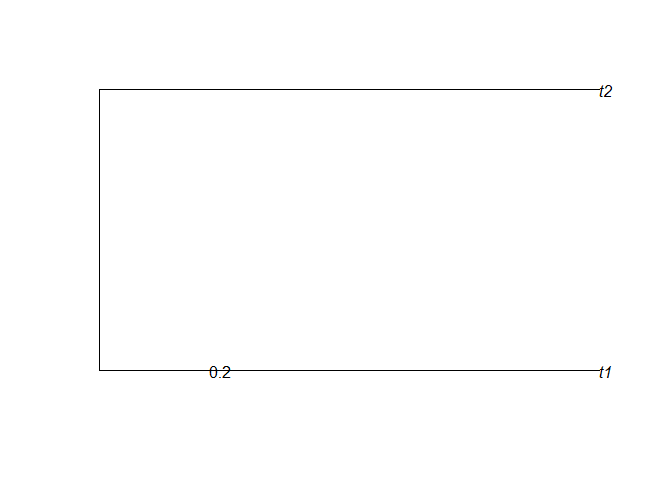
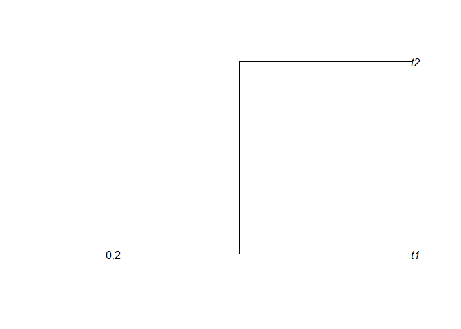
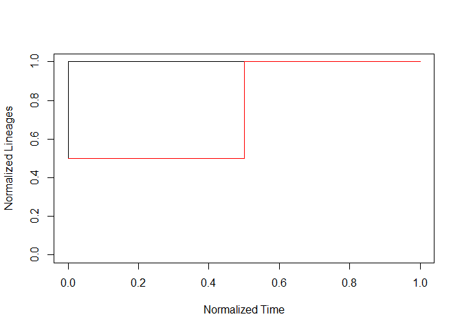

Trees with a root edge
================

This document intends to display a feature of the nLTT package: if a
stem is added to a phylogeny, the begin of that stem is set as the most
recent common ancestor.

Here I create a random phylogeny:

``` r
set.seed(42)
tree1 <- ape::rcoal(2)
tree1$edge.length <- tree1$edge.length / tree1$edge.length[1]
```

I copy that same phylogeny and add a stem:

``` r
tree2 <- tree1
tree2$root.edge <- 1
```

Here is how the stemless phylogeny looks like:

``` r
ape::plot.phylo(tree1, root.edge = TRUE)
ape::add.scale.bar() #nolint
```

<!-- -->

I set root.edge to TRUE, just show it is absent.

Here is how the phylogeny with stem looks like:

``` r
ape::plot.phylo(tree2, root.edge = TRUE)
ape::add.scale.bar() #nolint
```

<!-- -->

When overlaying their nLTT plots, one can expect two things:

it is assumed that the phylogeny without a root is leading, and the
other phylogeny has its root removed

it is assumed that the phylogeny with a root is leading, and the other
phylogeny is assumed to have a root of length zero

The nLTT package does the latter:

``` r
nLTT::nltt_plot(tree1, xlim = c(0, 1), ylim = c(0, 1))
nLTT::nltt_lines(tree2, col = "red")
```

<!-- -->

When looking at the nLTT plot, one can eyeball that the nLTT statistic
(the surface between the two curves) is around about one quarter.

When calculating the nLTT statistic, one needs to explicitly set to take
the stems into account:

``` r
print(nLTT::nLTTstat_exact(tree1, tree2, ignore_stem = FALSE))
```

    ## [1] 0.25

When ignoring the stems, the phylogenies are equal, thus have an nLTT
statistic of zero:

``` r
print(nLTT::nLTTstat_exact(tree1, tree2, ignore_stem = TRUE))
```

    ## [1] 0
