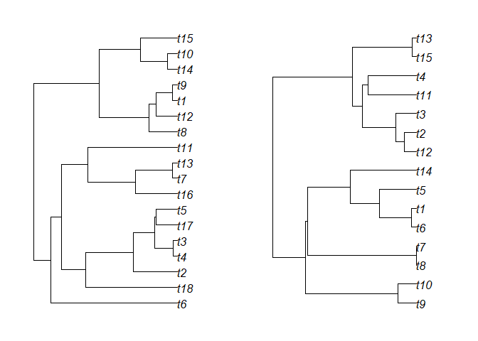
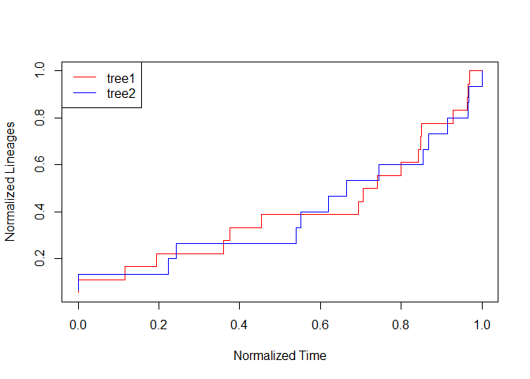
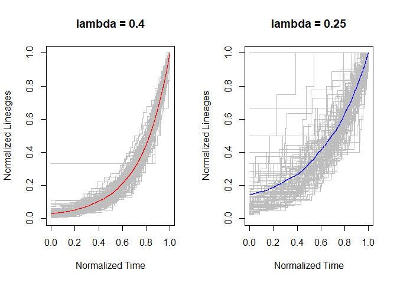
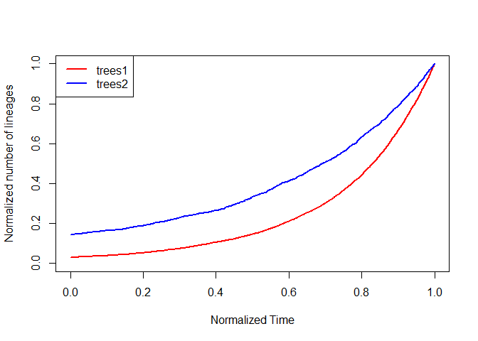

Worked examples
================

For all examples, the following R code must be run:

``` r
library(TESS)
library(nLTT)
```

## nLTT statistic & nLTT plot

In order to provide some worked examples, we first generate two random
phylogenetic trees, with similar parameter settings. Using the TESS
package we simulate one tree with lambda = 0.4, and one tree with lambda
= 0.25, both for 10 million years.

``` r
set.seed(42)
tree1 <- TESS::tess.sim.age(
  n = 1,
  age = 10,
  lambda = 0.4,
  mu = 0
)[[1]]
tree2 <- TESS::tess.sim.age(
  n = 1,
  age = 10,
  lambda = 0.25,
  mu = 0
)[[1]]
par(mfrow = c(1, 2))
par(mar = c(2, 2, 2, 2))
plot(tree1)
plot(tree2)
```

<!-- -->

The two trees look similar, but are not identical in shape: Phylo tree
plots

This becomes even more obvious when we plot their normalized Lineage
Through Time plots:

``` r
nltt_plot(tree1, col = "red")
nltt_lines(tree2, col = "blue")
legend("topleft",
       c("tree1", "tree2"),
       col = c("red", "blue"),
       lty = 1)
```

<!-- -->

## nLTT tree plots

Furthermore, we can now calculate the difference between the two nLTT
lines using `nLTTstat()`, and it’s more precise counterpart
`nLTTstat_exact()`:

``` r
nLTTstat(tree1,tree2)
```

    ## [1] 0.05257563

``` r
nLTTstat_exact(tree1,tree2)
```

    ## [1] 0.05257563

Which yields almost identical results. The function `nLTTstat()`
constructs two approximate step functions, from which it calculates the
difference and integrates this difference from 0 to 1. The function
`nLTTstat_exact()` iterates through all the (normalized) branching times
and for each time point calculates the difference and multiplies it with
the time since the previous timepoint (e.g. manual integration).
Typically results for `nLTTstat()` and `nLTTstat_exact()` are highly
similar. For smaller trees `nLTTstat_exact()` is preferred, as it has
higher accuracy, and is faster. For extremely large trees (+500 tips)
`nLTTstat()` is faster, and the sacrifice in accuracy is minimal.

## Average nLTT matrix & Average nLTT plot

Sometimes, it might be more interesting to look at the average nLTT plot
across a large number of replicate trees, or to calculate the average
normalized Lineages Through Time, for a large number of replicate trees.

Let us first generate 100 random trees:

``` r
set.seed(42)
trees1 <- TESS::tess.sim.age(
  n = 100,
  age = 10,
  lambda = 0.4,
  mu = 0
)
trees2 <- TESS::tess.sim.age(
  n = 100,
  age = 10,
  lambda = 0.25,
  mu = 0
)
```

Using the function get\_average\_nltt we can now plot the normalized
Lineages Through Time for all replicates, and on top of that plot the
average normalized Lineages Through Time. The replicates are all plotted
in grey, and the average lines are plotted in red and blue respectively:

``` r
par(mfrow = c(1, 2))
nltts_plot(
  trees1,
  dt = 0.001,
  plot_nltts = TRUE,
  col = "red",
  main = "lambda = 0.4"
)
nltts_plot(
  trees2,
  dt = 0.001,
  plot_nltts = TRUE,
  col = "blue",
  main = "lambda = 0.25"
)
```

<!-- -->

`average_nltt_plots()` Instead of plotting the average normalized
Lineages Through Time, we can also calculate them, and store them in a
matrix:

``` r
m1 <- get_average_nltt_matrix(trees1, dt = 0.001)
m2 <- get_average_nltt_matrix(trees2, dt = 0.001)
```

This allows us to do further analysis, and also allows us to plot the
two average nLTT plots on top of each other, to see whether the two
average nLTT plots differ from each other (mind you, m1 and m2 are
matrices, not nLTT objects, so we can plot them using the normal
plotting tools available in R)

``` r
m1 <- get_average_nltt_matrix(trees1, dt = 0.001)
m2 <- get_average_nltt_matrix(trees2, dt = 0.001)
plot(
  m1,
  type = "l",
  col = "red",
  lwd = 2,
  xlim = c(0, 1),
  ylim = c(0, 1),
  xlab = "Normalized Time",
  ylab = "Normalized number of lineages"
)
lines(m2, type = "l", col = "blue", lwd = 2)
legend(
  "topleft",
  c("trees1", "trees2"),
  col = c("red", "blue"),
  lty = 1,
  lwd = 2
)
```

<!-- -->
